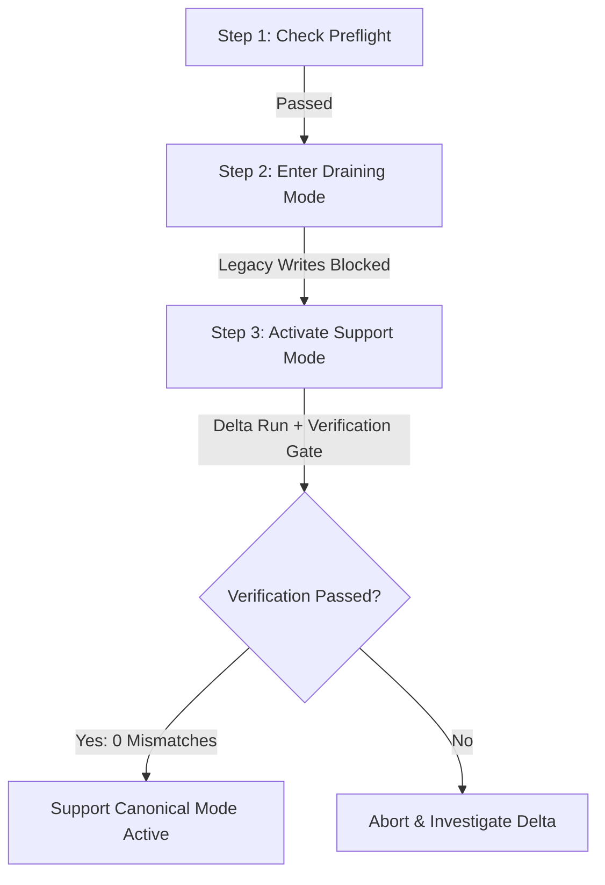

# 6ixCulture Enterprise AI Support — Production Cutover Runbook

**Document Version:** 1.0.0  
**Phase:** Phase 10 — Production Cutover  
**Target Environment:** Production / Staging  
**Service:** 6ixCulture AI Customer Support Domain  
**Target Date:** Operational Release Window  

---

## 1. Executive Overview

This runbook provides deterministic, step-by-step procedures for transitioning traffic from the legacy single-table chat system to the enterprise **6ixCulture AI Support domain** (`SupportConversation`, `SupportMessage`, `SupportTicket`, `SupportVoiceSession`, `SupportAuditLog`).

### Key Invariants
1. **Single Canonical Write Path**: At no point do legacy tables (`chat_conversations`, `chat_messages`) and modern Support tables accept dual writes.
2. **Server-Authoritative State**: Cutover state is persisted in database settings (`Settings::group('support')->get('cutover_state')`) with valid states: `legacy`, `draining`, `support`.
3. **Write Gating**: In `draining` and `support` states, legacy chat mutation endpoints return HTTP 423 (Locked) with migration instructions.
4. **Guarded Rollback**: Rollbacks from `support` to `legacy` fail closed if any domain activity (conversations, messages, tickets, voice sessions) occurred post-cutover.
5. **No Legacy Deletion**: Legacy models, tables, routes, and controllers remain preserved for read fallback until Phase 11 verified cleanup.

---

## 2. Pre-Cutover Verification & Preflight Checklist

Run all checks from the application root directory using the CLI:

### 2.1 Database & Schema Readiness
```bash
# 1. Verify schema tables exist and migrations are up to date
php artisan migrate:status

# 2. Check current cutover status and governance seeding
php artisan support:cutover --status
```
*Expected Output:*
- Schema tables ready: `YES`
- Active Departments: $\ge 1$
- Active Policies: $\ge 1$
- Active Tools: $\ge 1$
- Current State: `LEGACY`

### 2.2 Preflight Audit & Dry-Run
```bash
php artisan support:cutover --preflight
```
*Expected Output:*
- Audit counts reported accurately for legacy records.
- Dry-run migration reports status `completed` with `0` errors.
- Preflight summary confirms system readiness.

---

## 3. Step-by-Step Operator Cutover Procedure



### Step 1: Pre-Flight Verification
Execute preflight checks:
```bash
php artisan support:cutover --preflight
```
*Action:* Confirm 0 database or schema errors.

### Step 2: Enter Draining Mode
Lock legacy mutation routes to prevent new chat entries or agent replies while preparing for final sync:
```bash
php artisan support:cutover --enter-draining
```
*Verification:*
- Legacy mutation endpoints (`/api/chat/send`, `/api/frontend/chat/send`, `/api/admin/chat/reply/{id}`, etc.) now return `HTTP 423 Locked`.
- Legacy historical reads (`/api/chat/history`, `/api/admin/chat`, `/api/admin/chat/show/{id}`) remain operational.

### Step 3: Activate Support Domain (Final Delta + Parity Gate)
Execute the final delta migration, verify full data parity (0 mismatches), and switch the server-authoritative state to `support`:
```bash
php artisan support:cutover --activate-support
```
*What Happens Automatically:*
1. Runs `LegacyChatMigrationService::migrate(['apply' => true])` for any final legacy messages.
2. Runs `LegacyChatAuditService::verifyParity()`.
3. Verifies `mismatch_count === 0`.
4. Updates persistent state `cutover_state = 'support'`.
5. Records timestamp `support_activated_at`.
6. Generates structured audit log `support_cutover_activated`.

### Step 4: Post-Cutover Status Check
Verify the cutover state:
```bash
php artisan support:cutover --status
```
*Expected Table:*
- Current State: `SUPPORT`
- Support Domain Canonical: `YES`
- Legacy Writes Blocked: `YES`
- Verification Passed: `YES`

---

## 4. Endpoint Routing & Traffic Reference

| Channel | User Role | Canonical Endpoint (Post-Cutover) | Legacy Endpoint (Gated) |
|---|---|---|---|
| Customer Chat | Customer / Guest | `POST /api/v1/support/conversations` | `POST /api/chat/send` (HTTP 423) |
| Customer Message | Customer / Guest | `POST /api/v1/support/conversations/{id}/messages` | `POST /api/frontend/chat/send` (HTTP 423) |
| Customer Voice | Customer / Guest | `POST /api/v1/support/conversations/{id}/voice/session` | N/A (New capability) |
| Agent Support | Agent / Admin | `GET /admin/support` (`SupportCenterComponent.vue`) | `GET /admin/chat` (Read-only) |
| Agent Reply | Agent / Admin | `POST /api/v1/support/agent/conversations/{id}/reply` | `POST /api/admin/chat/reply/{id}` (HTTP 423) |
| Governance | Admin | `GET /admin/support/governance` (`SupportGovernance.vue`) | N/A |

---

## 5. Emergency Rollback Procedures

### 5.1 Guarded Rollback Criteria
Rollback from `support` back to `legacy` is strictly controlled:
- **Condition A (Clean Rollback)**: If zero customers/agents have initiated conversations, sent messages, or created tickets since `support_activated_at`, rollback succeeds automatically.
- **Condition B (Guarded Block / Fail-Closed)**: If any `SupportConversation`, `SupportMessage`, `SupportTicket`, or `SupportVoiceSession` has been created post-activation, rollback **FAILS CLOSED** to prevent data loss or orphaned customer tickets.

### 5.2 Rollback Execution
```bash
# Standard guarded rollback
php artisan support:cutover --rollback
```
If post-cutover data exists, the command outputs:
```
Rollback blocked: Post-cutover domain records exist that would be orphaned by reverting to legacy.
Blockers:
  • 3 Support conversations created post-cutover (since 2026-08-19 09:00:00).
  • 12 Support messages created post-cutover.
```

### 5.3 Forced Rollback (Emergency Only)
If the incident commander determines that an emergency regression requires reverting despite new activity:
```bash
php artisan support:cutover --rollback --force
```
*Note:* Requires manual reconciliation of any new tickets created during the cutover window.

---

## 6. Real-Time Health & Incident Monitoring

| Metric | Target | Health Indicator |
|---|---|---|
| Support API Latency (`/api/v1/support/*`) | < 500ms p95 | Normal |
| AI Orchestration Fallback Rate | < 2% | Normal |
| Realtime Webhook / Echo Events | Active | Normal |
| Legacy Mutation Attempts | Draining to 0 | Expected |
| Support Audit Logs | Streaming | Expected |
