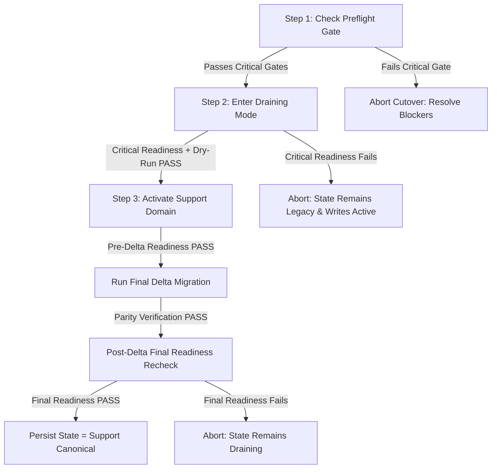

# 6ixCulture Enterprise AI Support — Production Cutover Runbook

**Document Version:** 2.1.0 (Final Cutover Readiness Hardened)  
**Phase:** Phase 10 — Production Cutover  
**Target Environment:** Production / Staging  
**Service:** 6ixCulture AI Customer Support Domain  
**Baseline Commit:** `62a6ffa`  

---

## 1. Executive Overview & Strict Invariants

This runbook provides deterministic, step-by-step procedures for transitioning traffic from the legacy single-table chat system to the enterprise **6ixCulture AI Support domain** (`SupportConversation`, `SupportMessage`, `SupportTicket`, `SupportVoiceSession`, `SupportAssignment`, `SupportFeedback`, `SupportAuditLog`).

### Key Invariants & Safety Gates
1. **Strict Legal Transition Matrix**:
   - `legacy` $\to$ `draining` $\to$ `support`.
   - Direct backward transition `support` $\to$ `draining` is **strictly forbidden and fails closed**.
   - Direct activation `legacy` $\to$ `support` is **strictly rejected** (system must enter draining first).
   - Idempotent transitions (`legacy` $\to$ `legacy`, `draining` $\to$ `draining`, `support` $\to$ `support`) are safely handled.
2. **Readiness-Gated Draining (`enterDraining`)**:
   - `SupportCutoverManager::enterDraining()` evaluates live Support readiness before modifying state.
   - If critical gates fail, the transition is **rejected**, state remains `legacy`, legacy mutations remain enabled, and the failure is audited.
   - The CLI `--enter-draining` command also runs a migration dry-run check prior to requesting state change.
3. **Selected AI Provider Validation (Zero Cross-Provider Leakage)**:
   - AI readiness uses `AiProviderFactory::make()` and checks `isConfigured()` directly on the resolved runtime adapter (`OpenrouterSupportAdapter`, `GeminiSupportAdapter`).
   - Cross-provider false positives are completely eliminated: credentials for Provider A do not satisfy readiness if Provider B is selected.
   - Zero credentials, secrets, or headers are exposed in readiness reports.
4. **Single Canonical Write Path**: At no point do legacy tables (`chat_conversations`, `chat_messages`) and modern Support tables accept dual writes.
5. **Server-Authoritative State**: Cutover state is persisted in database settings (`Settings::group('support')->get('cutover_state')`).
6. **Sanitized Legacy Route Gating**: In `draining` and `support` states, legacy chat mutation endpoints return HTTP 423 (Locked) with generic customer-safe messaging, exposing zero internal paths, namespaces, or cutover state tokens.
7. **Two-Stage Activation Readiness Gating**:
   - `activateSupport()` evaluates live critical readiness **before** executing the final delta migration.
   - `activateSupport()` re-evaluates live critical readiness a second time **after** migration verification and immediately **before** persisting `cutover_state = support`.
   - If readiness fails at either stage, activation aborts, state remains `draining`, and verification data is preserved.
8. **Unbypassable Rollback Guard & Clean Metadata Reset**:
   - Evaluates all post-activation domain activity: conversations, messages, tickets, voice sessions, agent assignments, feedback, and operational audit events.
   - Rollback **strictly fails closed** if post-cutover activity occurred.
   - Upon safe rollback, active cutover metadata (`support_activated_at`, `cutover_started_at`, `activated_by`, `final_delta_migration_run_id`, `verification_passed`) is completely cleared.
9. **Preservation of Legacy Assets**: Legacy code, models, tables, and routes remain completely preserved for read fallback until Phase 11 verified cleanup.

---

## 2. Pre-Cutover Verification & Preflight Checklist

Run all checks from the application root directory using the CLI:

### 2.1 Database & Schema Readiness
```bash
# 1. Check current cutover status and computed readiness
php artisan support:cutover --status
```
*Expected Output:*
- Schema tables ready: `YES`
- AI Provider Configured: `YES`
- Active Departments: $\ge 1$
- Active Policies: $\ge 1$
- Active Tools: $\ge 1$
- Current State: `LEGACY`
- Readiness Status: `READY` or `DEGRADED` (if non-blocking fallbacks active)

### 2.2 Preflight Audit & Readiness Evaluation
```bash
php artisan support:cutover --preflight
```
*Expected Output:*
- Audit counts reported accurately for legacy records.
- Dry-run migration reports status `completed` with `0` errors.
- Preflight Summary confirms all critical gates `PASS`.
- Exit code is `0`.

---

## 3. Step-by-Step Operator Cutover Procedure



### Step 1: Pre-Flight Verification
Execute preflight checks:
```bash
php artisan support:cutover --preflight
```
*Action:* Confirm 0 critical blockers and exit code 0.

### Step 2: Enter Draining Mode
Lock legacy mutation routes to prevent new chat entries or agent replies while preparing for final sync:
```bash
php artisan support:cutover --enter-draining
```
*Verification:*
- Critical readiness and migration dry-run are evaluated.
- Legacy mutation endpoints (`/api/chat/send`, `/api/frontend/chat/send`, `/api/admin/chat/reply/{id}`, etc.) now return `HTTP 423 Locked`.
- Legacy historical reads (`/api/chat/history`, `/api/admin/chat`, `/api/admin/chat/show/{id}`) remain operational.

### Step 3: Activate Support Domain (Pre-Readiness + Delta + Verification + Final Readiness Gate)
Execute the final delta migration, verify full data parity (0 mismatches), recheck live system readiness, and activate `support` state:
```bash
php artisan support:cutover --activate-support
```
*What Happens Automatically:*
1. Verifies current state is `draining`.
2. Evaluates live system readiness via `SupportReadinessService`.
3. Runs `LegacyChatMigrationService::migrate(['apply' => true])` for any final delta messages.
4. Runs `LegacyChatAuditService::verifyParity()`.
5. Verifies `mismatch_count === 0`.
6. Rechecks live system readiness a second time immediately before state persistence.
7. Updates persistent state `cutover_state = 'support'`.
8. Records timestamp `support_activated_at`.
9. Generates structured audit log `support_cutover_activated`.

### Step 4: Post-Cutover Status Check
Verify the cutover state:
```bash
php artisan support:cutover --status
```
*Expected Table:*
- Current State: `SUPPORT`
- Support Domain Canonical: `YES`
- Legacy Writes Blocked: `YES`
- Verification Passed: `YES`

---

## 4. Endpoint Routing & Traffic Reference

| Channel | User Role | Canonical Endpoint (Post-Cutover) | Legacy Endpoint (Gated) |
|---|---|---|---|
| Customer Chat | Customer / Guest | `POST /api/v1/support/conversations` | `POST /api/chat/send` (HTTP 423) |
| Customer Message | Customer / Guest | `POST /api/v1/support/conversations/{id}/messages` | `POST /api/frontend/chat/send` (HTTP 423) |
| Customer Voice | Customer / Guest | `POST /api/v1/support/conversations/{id}/voice/sessions` | N/A (New capability) |
| Agent Support | Agent / Admin | `GET /admin/support` (`SupportCenterComponent.vue`) | `GET /admin/chat` (Read-only) |
| Agent Reply | Agent / Admin | `POST /api/v1/support/agent/conversations/{id}/reply` | `POST /api/admin/chat/reply/{id}` (HTTP 423) |
| Governance | Admin | `GET /admin/support/governance` (`SupportGovernance.vue`) | N/A |

---

## 5. Unbypassable Rollback Safety Procedures

### 5.1 Guarded Rollback Criteria
Rollback from `support` back to `legacy` is strictly controlled:
- **Clean Rollback**: If zero domain records or operational events have occurred since `support_activated_at`, rollback succeeds automatically and clears all active cutover metadata.
- **Guarded Block (Fail-Closed)**: If any of the following exist post-activation, rollback **strictly fails closed**:
  - `SupportConversation`
  - `SupportMessage`
  - `SupportTicket`
  - `SupportVoiceSession`
  - `SupportAssignment`
  - `SupportFeedback`
  - Domain operational audit events

### 5.2 Rollback Execution
```bash
php artisan support:cutover --rollback
```
If post-cutover data exists, the command outputs:
```
Rollback blocked: Post-cutover Support domain activity detected. Automated rollback is forbidden to prevent data loss.

Rollback Blockers (Fail-Closed Data Protection):
  • 2 Support conversations created post-cutover.
  • 5 Support messages created post-cutover.
  • 1 Support tickets created post-cutover.
```
